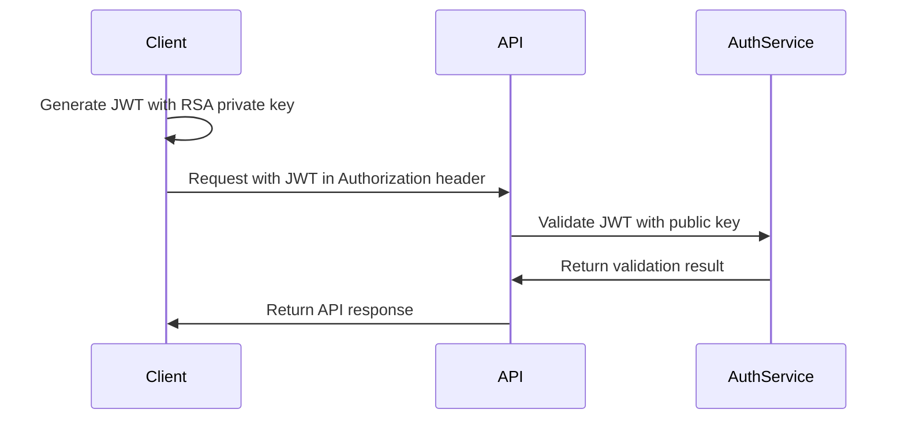

# GroupVAN V3 API Client Libraries

Official client libraries for authenticating with GroupVAN V3 APIs using JWT tokens with RSA256 asymmetric cryptography.

## Overview

These client libraries demonstrate how to generate JWT tokens for authenticating with GroupVAN's V3 APIs. All libraries implement the same authentication pattern using RSA256 (RS256) algorithm for enhanced security through asymmetric cryptography.

## Security Model

- **RSA256 Algorithm**: All tokens are signed using RSA private keys and verified with RSA public keys
- **Asymmetric Cryptography**: Servers only need your public key; private keys remain secure on client side
- **Short-lived Tokens**: Default 5-minute expiration for enhanced security
- **Key Rotation Support**: Multiple keys can be active simultaneously

## Available Client Libraries

| Language | Directory | Package Manager | Documentation |
|----------|-----------|----------------|---------------|
| Python | [`python/`](./python) | pip | [README](./python/README.md) |
| Node.js | [`nodejs/`](./nodejs) | npm | [README](./nodejs/README.md) |
| PHP | [`php/`](./php) | composer | [README](./php/README.md) |
| C#/.NET | [`csharp/`](./csharp) | NuGet | [README](./csharp/README.md) |

## Quick Start

### 1. Generate RSA Key Pair

Each client library includes utilities to generate RSA key pairs:

```bash
# Python
python clients/python/client.py

# Node.js
node clients/nodejs/client.js

# PHP
php clients/php/Client.php

# C#
dotnet run --project clients/csharp
```

### 2. Register Your Public Key

Share your RSA public key with GroupVAN to register your developer credentials. Keep your private key secure and never share it.

### 3. Generate JWT Tokens

Use your private key to sign JWT tokens with the following claims:

```json
{
  "aud": "groupvan",
  "iss": "your_developer_id",
  "kid": "your_key_id",
  "iat": 1234567890,
  "exp": 1234568190
}
```

### 4. Make Authenticated Requests

Include the JWT token in the Authorization header:

```
Authorization: Bearer <your_jwt_token>
```

## Authentication Flow



## Token Structure

### Header
```json
{
  "alg": "RS256",
  "typ": "JWT",
  "kid": "your_key_id",
  "gv-ver": "GV-JWT-V1"
}
```

### Payload
```json
{
  "aud": "groupvan",
  "iss": "developer_id",
  "kid": "key_id",
  "iat": 1234567890,
  "exp": 1234568190
}
```

### Signature
Generated using RSA256 algorithm with your private key.

## Best Practices

1. **Key Security**
   - Store private keys securely (use environment variables or secure vaults)
   - Never commit private keys to version control
   - Rotate keys periodically

2. **Token Management**
   - Generate fresh tokens for each request or session
   - Use short expiration times (5 minutes recommended)
   - Don't reuse tokens across different services

3. **Error Handling**
   - Implement retry logic with exponential backoff
   - Handle token expiration gracefully
   - Log authentication failures for monitoring

## API Endpoints

All authenticated requests should be made to:
```
https://api.groupvan.com/v3/{endpoint}
```

For local development:
```
http://localhost:5000/v3/{endpoint}
```

## Common Use Cases

### Catalog Management
- `GET /catalogs` - List catalogs
- `GET /catalogs/{id}` - Get catalog details
- `POST /catalogs` - Create new catalog
- `PUT /catalogs/{id}` - Update catalog
- `DELETE /catalogs/{id}` - Delete catalog

### Order Processing
- `GET /orders` - List orders
- `GET /orders/{id}` - Get order details
- `POST /orders` - Create new order
- `PUT /orders/{id}` - Update order status

## Testing

Each client library includes example code that demonstrates:
- RSA key pair generation
- JWT token generation
- Token verification
- API request examples

Run the examples to verify your setup:

```bash
# Test Python client
cd python && python client.py

# Test Node.js client
cd nodejs && npm install && node client.js

# Test PHP client
cd php && composer install && php Client.php

# Test C# client
cd csharp && dotnet run
```

## Error Handling

All clients provide standardized error handling:

| HTTP Status | Error Code | Description |
|-------------|------------|-------------|
| 401 | `INVALID_TOKEN` | Invalid or expired JWT token |
| 401 | `INVALID_CREDENTIALS` | Developer credentials not found |
| 403 | `ACCESS_DENIED` | Valid token but insufficient permissions |
| 429 | `RATE_LIMITED` | Too many requests |
| 500 | `SERVER_ERROR` | Internal server error |

## Rate Limiting

The API implements rate limiting per developer_id:
- Default: 1000 requests per hour
- Burst: 50 requests per minute

Rate limit headers in responses:
- `X-RateLimit-Limit`: Maximum requests per hour
- `X-RateLimit-Remaining`: Remaining requests
- `X-RateLimit-Reset`: Unix timestamp when limit resets

## Environment Variables

All clients support configuration via environment variables:

```bash
export GROUPVAN_DEVELOPER_ID="your_developer_id"
export GROUPVAN_KEY_ID="your_key_id"
export GROUPVAN_PRIVATE_KEY_PATH="/path/to/private_key.pem"
export GROUPVAN_API_URL="https://api.groupvan.com/v3"
```

## Installation

### Python
```bash
cd python
pip install pyjwt cryptography requests
```

### Node.js
```bash
cd nodejs
npm install jsonwebtoken axios
```

### PHP
```bash
cd php
composer install
```

### C#/.NET
```bash
cd csharp
dotnet add package System.IdentityModel.Tokens.Jwt
dotnet add package Newtonsoft.Json
```

## Contributing

We welcome contributions! Please follow these guidelines:

1. Fork the repository
2. Create a feature branch
3. Add tests for new functionality
4. Update documentation
5. Submit a pull request

### Code Style

- Node.js: ESLint with Standard style
- Python: PEP 8
- PHP: PSR-12
- C#: Microsoft C# Coding Conventions

## Version Compatibility

| Client Version | API Version | Minimum Language Version |
|---------------|-------------|-------------------------|
| 1.0.0 | V3 | Node.js 14+, Python 3.7+, PHP 7.4+, .NET 6.0+ |

## Troubleshooting

### Common Issues

**"Invalid authentication token"**
- Verify RSA private key is in correct PEM format
- Check token hasn't expired
- Ensure all required claims are present
- Confirm public key is registered with server

**"Invalid developer credentials"**
- Confirm developer_id and key_id are correct
- Check credentials are enabled in the system
- Verify public key matches private key

**"Token generation fails"**
- Ensure required dependencies are installed
- Verify system time is synchronized
- Check RSA key format is correct

### Debug Mode

Enable debug logging in each client:

```javascript
// Node.js
process.env.DEBUG = 'groupvan:*';

// Python
import logging
logging.basicConfig(level=logging.DEBUG)

// PHP
$client->setDebug(true);

// C#
client.EnableDebugLogging();
```

## Migration Guide

### From HS256 to RS256

1. Generate new RSA key pair using client utilities
2. Register public key with GroupVAN
3. Update client code to use RSA private key instead of shared secret
4. Change algorithm from HS256 to RS256
5. Test in staging environment
6. Deploy to production

### From API Key Authentication

1. Generate RSA key pair
2. Register public key with GroupVAN
3. Update client initialization code
4. Replace API key headers with JWT Authorization header
5. Test and deploy

## Support

For issues or questions:
- API Documentation: https://api.groupvan.com/docs
- Support Email: api@groupvan.com
- GitHub Issues: https://github.com/groupvan/api-clients

## License

MIT License - See [LICENSE](./LICENSE) file for details

## Changelog

### Version 2.0.0 (2024)
- Updated to RSA256 algorithm for enhanced security
- Added asymmetric key support
- Improved key rotation capabilities
- Enhanced security with public/private key pairs

### Version 1.0.0 (2024)
- Initial release with HS256
- Support for Node.js, Python, PHP, and C#

---

© 2024 GroupVAN. All rights reserved.